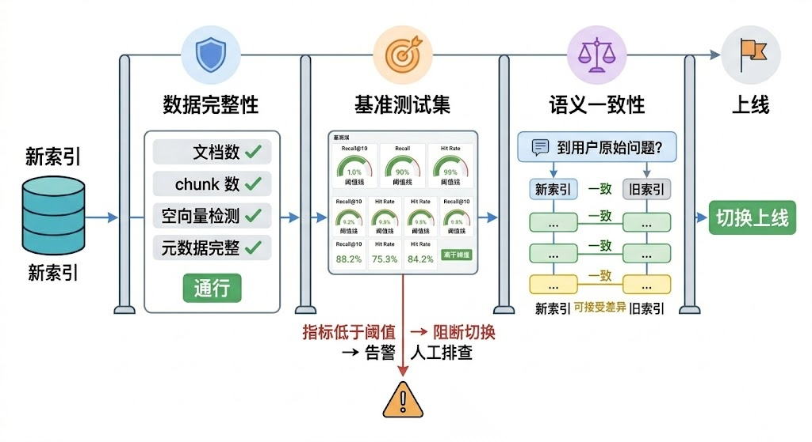

# Rag知识库更新文档

这就引出了更新策略的三个核心维度：**什么时候更新**（触发机制）、**更新多少**（粒度控制）、**怎么保证更新质量**（验证机制）

# 一\.触发机制：

1. 定时全量重建：

比如每天凌晨把所有文档重新跑一遍加工链，生成新的向量索引，然后整体替换旧索引。这种方式实现最简单，不需要追踪哪些文档变了，每次都是全量覆盖。对于文档量不大（比如几千篇以内）、更新频率要求不高（天级别就够）的场景，全量重建完全够用，而且由于每次都是从零构建，不存在增量更新可能引入的脏数据问题。

2. **增量更新**

- 基于文件哈希的检测是最通用的方案。对每个源文档计算内容哈希（比如 MD5 或 SHA256），存到一张元数据表里。每次更新时重新计算哈希，和上一次比较——哈希变了就说明内容变了，需要重新处理；哈希没变就跳过。这种方式不依赖任何外部系统，适用面最广。

- 基于事件驱动的检测更实时。如果文档源头是一个 CMS 系统或者 Wiki 平台，通常可以通过 Webhook 或者消息队列拿到文档创建/修改/删除的事件通知。收到通知后立即触发对应文档的更新处理，做到分钟级甚至秒级的准实时更新。这种方式延迟最低，但需要源头系统支持事件推送，而且要处理好事件的幂等性和顺序性问题。

（事件驱动比较适配车源更新，当数据库更新到时候拿到通知之后进行改动）

- 基于时间戳的检测是一种折中方案。记录每个文档的最后修改时间，每次更新时只处理上次更新之后有修改的文档。实现简单，但依赖源系统提供准确的修改时间，而且无法检测到内容没变但文件被重新保存了这种假变更（虽然这种情况下重新处理一次也没什么大问题）。

# 二\.粒度控制：

chunk级还是文档级或者原子事务级（我们场景就原子事务级，然后其他的都文档级）但是粒度控制越小实现复杂度就高，可能要维持映射关系，条目和数据库的或者文档和chunk的

#### Overlap 连锁反应

为了防止语义在 Chunk 边界断裂，生产中几乎都会设置 overlap（通常 10%\~20%）。这意味着 Chunk 之间有重叠内容，一个 Chunk 的变化会通过 overlap 传播给相邻 Chunk，进一步放大偏移效应。

## **元数据追踪**

每个 chunk 在写入向量数据库时，都应该携带足够的元数据——至少包括：源文档 ID、源文档的内容哈希、chunk 在文档中的位置索引、写入时间、Embedding 模型版本。有了这些元数据，增量更新时才能准确定位"这个文档对应的 chunk 有哪些"，也方便后续做数据审计和问题排查。

# 三\.在线平台的平滑切换：

常见的解决方案是双索引切换（也叫蓝绿部署思路）。维护两套向量索引，一套是线上正在服务的活跃索引，另一套是用于构建新版本的备用索引。更新时在备用索引上完成所有写入操作，经过质量验证后，通过一个原子操作将流量切换到新索引，旧索引随后释放。整个切换过程对用户完全无感知。

另一种方案是利用向量数据库自身的版本或别名机制。比如 Elasticsearch 的 alias 功能、Milvus 的 collection alias——你可以创建一个新的 collection 完成数据写入，然后把 alias 指向新 collection，一步完成切换。原理和双索引切换一样，只是利用了数据库的原生能力来实现。

都是类似指针的操作切换指针维持多备用知识库版本

PS\.如果我们的客服需要做到更新的时候防止用户发消息然后得到错误信息，可以考虑在线服务切换策略

# 四\.质量验证：

1\.数据完整性

2,检索召回质量

准备基准测试集（Benchmark）

# 五\.文档删除操作：

1\.软删除：打删除标记，能回滚

2\.硬删除：节省space

# 详细策略参考https://juejin\.cn/post/7659270153596157987

详细介绍了不同场景对应的更新比对。

