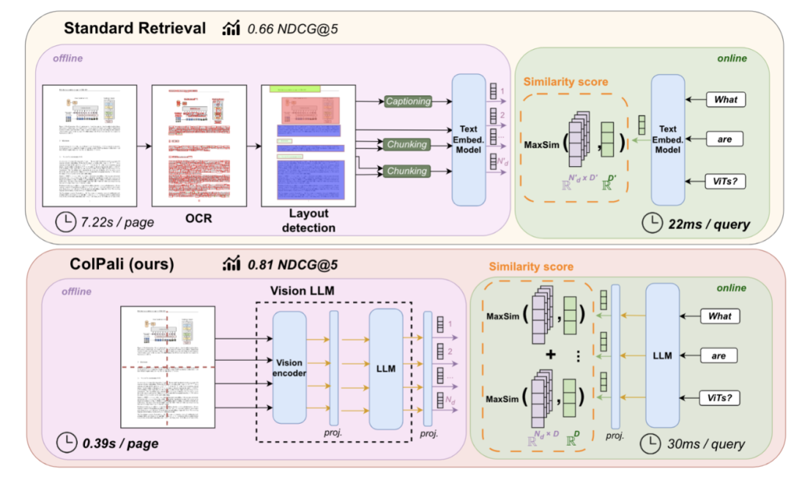

# 多模态RAG检索与embedding

传统RAG采用OCR文字识别，读取其中的文本而导致大量的图片等等信息的损失

改进做法：多模态信息全部转成文本（利用VLM模型）比如YOLO的系列或者多模态大模型进行解读（MInerU也能做到在agent里做一个function calling）对于表格和公式直接转latex即可。

# 1\.直接利用多模态LLM做embedding

多模态的大模型直接做广义OCR的提取能力现在非常强能直接把图片embedding做rag，但是定制化的信息是否能直接做知识库，效果怎么样还是有待考究（待解决）

### **DSE模型**

https://arxiv\.org/abs/2406\.11251

直接把原始文档图片切片\-\-\-VLM编码

### ColiPali

https://arxiv\.org/abs/2407\.01449

架构核心都是用VLM处理图片

# 2\.MRAG：

### 一层扫描摘要然后定位正文的精确原子事实替换粗粒度摘要

优化检索问题的相关性，采用更深层的记忆：

先对事件摘要进行粗略扫描，找到正确的大致范围，然后在这些事件中**展开**到精确的原子事实——并用这些事实在最终结果中替换更粗粒度的摘要。

### [EverOS（EverMind\-AI）](https://github.com/EverMind-AI/EverOS.git)

五段流水线工作（像流水线CPU一样。。。）

#### 1\.跨摘要的粗检索：

1. 嵌入搜索\-\-cos相似度

2. BM25关键词检索

3. 融合1 2得到排序表然后RRF重排或者逻辑回归

#### 2\.搜索结构建立：

- 小顶堆：保存前N个结果（出现新的相似候选快速替换）

- 大顶堆：覆盖所有粗检索结果\-\-\-\-按RRF得分排序决定接下来要检索和处理的事件（进入候选队列最终有可能进小顶堆替换）

#### 3\.mRAG检索

关键设计是：当某个原子事实的得分足够高、进入前 N 结果时，它的父事件会从该集合中**移除**。精确的事实取代粗粒度的摘要。

检索打分公式：f\_score表示相似度，e\_score表示和父事件传播下来的相关性，α为权重

**final\_score = α × fact\_score \+ \(1 \- α\) × episode\_score**

**（****存在定制化可能，分层检索可以让我们设计更多约束，如果直接把技术文档全文做检索相似度最高的不一定是我们要得到的，但是一般摘要里面会给出整个技术文档的主旨，如果既和主旨相关性高，又和文档相似度高，更有可能命中语义****）**

#### 4\.输出：

循环收敛输出小顶堆（除了打分高还加入了相关性问题进一步减少幻觉）

#### 5\.重排序：

### 返回结果：

**事件**——与查询提供上下文的相关记忆记录，其中没有原子事实能清晰地替代它们。

**事实**——从记忆中提取出的、能够直接回答你查询的精确原子陈述。每个事实都带有其主题标签、父记忆 ID 和最终相关性得分。

一个记录相关性和记忆（语义）的相关性，一个返回语义相似性。

mRAG 与数据类型无关。相同的流水线可跨对话、文档、电子邮件、会议记录、PDF、表格、演示文稿和图像进行检索——因为这些内容在摄取时都会被处理成相同的 Episodic Memory 和 AtomicFact 结构。

可以做到多模态，所有类型数据都会映射成同类结构

### 记忆只有在检索足够精确时才有用。

这个检索能缓解VLM和MLLM强大的处理能力背后的幻觉问题，记忆强大但是记忆量的庞杂和相似度重复度高导致输出你的记忆时出现幻觉（非常贴切的表达）

给定检索约束。（相当于动态调整提示词）

# 3\.图搜图，文搜图的embedding实现

前面提到了利用多模态llm处理多模态数据转成纯文本，但是这样图片变成文字信息还是会有缺失，而且难以做到用户提到的相关图片直接返回而不是返回图片表达的信息。

模型图太复杂了看不明白具体怎么实现的，说是直接存图片，映射到高维空间

https://zhuanlan\.zhihu\.com/p/2010305281456874080

https://arxiv\.org/abs/2410\.08182

