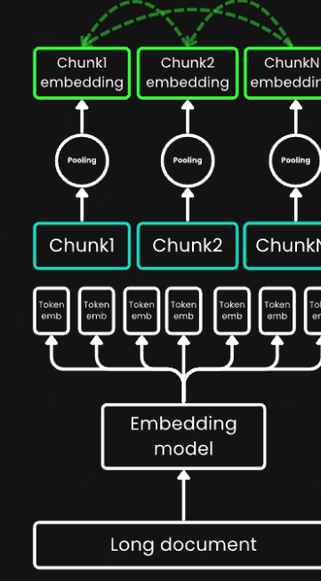

# 检索策略解析文档

# 一\.分段，分块，切分策略选择：

## 分块策略

合理的文本分块策略是提升 RAG 系统性能和大模型回答质量的关键

**固定大小分块、基于 NLTK 分块、特殊格式分块、深度学习模型分块、智能体式分块**

### 1\.固定大小块：

过于死板Pass

### 2\.基于NLTK分块：

自然语言处理 其中Spacy库比较强大的语言分割能力

### 3\.特殊格式分块：

对于特定文本HTML，Markdown，Latex等等这种就是有特殊切块方式但是真正对语义没有增长，这类数据本身提供了切分的范式的感觉

### 4\.语义分割切块：

- Embedding\-based：**基于嵌入向量的 semantic chunking** **方法本质上是基于滑动窗口（combined\_sentence）计算文本相似度。**那些相邻且符合阈值的句子会被归入一个语义块。

- model\-based：基于BERT的方法，计算上下多句话是否语义关系较大，设置阈值

yolo\-segment之前拿来做图像分割，其实本职应该是语义分割模型，图片是特殊的语言。cross\-seg/seqModel模型等等基于深度学习的模型

### 5\.LLM\-based分块

**atomic expressions\-新的检索单位在时序库提到过： proposition （分层\+模块化）**

原子事务。核心思路\-一种归并的感觉把小向量根据设定的阈值合并为chunk最后选出来最小chunk基于事实啊时间啊等等元素。和mrag的感觉很像会层层抽象检索时会一层层深度检索，也像unix文件系统一样，DNS分层架构一样，核心思想是分层加模块化。

small\-big的索引架构。

## **切分策略（不明确做法都是需要迭代调优）**

### **控制文本块长度**

### 重叠切分

### **考虑大模型的输入限制**

输入长度控制

优先级排序：引入相关性

内容精炼：**自动摘要，关键句提取**

### 去除重叠语义重复表达归一（比如缩写和全称）

## 前沿方法：

### 1\.Meta\-chunking：

- 第一种分块，称为Margin Sampling Chunking，大概思路是让LLM来做二分类，大模型输出是个词表的概率分布，这里他们做了一个对“是” 、 “否”的概率差，判断是否符合阈值。

- 第二种分块，称为Perplexity Chunking，计算每个句子在上下文下的困惑度（如果困惑度高，说明模型对这段文本比较懵逼，所以不建议切分）。每次找到序列中困惑度最小的句子，并且如果这个句子前后2句都小于当前这个句子，那就可以切分了。算困惑度可以利用固定长度的kv\-cache，来保证显存问题

### 2\.**Late Chunking：处理文档的分块**

整理一大堆文件。传统的方法是先把文件分成小堆,然后再逐一处理。而late分块却反其道而行之:先对整个文件进行全面处理,然后再进行分类整理

1. 先用一个长上下文嵌入模型\(比如 jina\-embeddings\-v2\-small\-en，具有 8K 上下文长度\)"读懂"整个文档

2. 然后再把这个"理解"切成小块

### 3\.Anthropic上下文添加分块：

每个chunk都添加上下文，相当于打标签，像给文件加inode，只有文件很难快速知道文件信息，需要比对检索。给chunk加上下文或者摘要都是不错的选择

## 分块策略总览：

其中父文档检索器（严格来说是检索策略也能算分块策略）

小块链接到更大的父块，父块作为返回的结果而不是返回小块，那么上下文关系保持的比较好，而且这个策略很灵活可以结合大多数策略使用

# 二\.基于数据的向量库的选择：都是开源的都差不多

### Chroma

### Milvus

### Faiss

### Weaviate：图模型（比较适配）但不支持java

1. 基于图的数据模型：Weaviate 使用图数据结构来存储和管理数据，每个数据点都作为图中的一个节点，这些节点可以通过边相互连接，以表示复杂的数据关系。

2. 机器学习集成：Weaviate 直接集成了机器学习模型，如[Transformer模型](https://zhida.zhihu.com/search?content_id=242448238&content_type=Article&match_order=1&q=Transformer%E6%A8%A1%E5%9E%8B&zhida_source=entity)，用于自动将文本和其他数据类型转换成高维向量。这种集成简化了AI驱动应用的开发流程。

3. 模块化和可扩展：Weaviate 的架构支持模块化，用户可以根据需要添加不同的模块来扩展功能，如自定义[向量化](https://zhida.zhihu.com/search?content_id=242448238&content_type=Article&match_order=1&q=%E5%90%91%E9%87%8F%E5%8C%96&zhida_source=entity)模块或特定的数据连接器。

4. 实时索引与查询：Weaviate 设计了实时数据索引和查询的能力，支持在大规模数据集上进行高效的向量搜索。

5. 丰富的API和客户端支持：Weaviate 提供了RESTful API、GraphQL接口，以及多种客户端库（如Python、JavaScript），便于开发者使用和集成。

6. 云原生和高可用性：Weaviate 是为云环境优化的，支持在Kubernetes上部署，确保了高可用性和弹性。

# 三\.传统检索策略选择：

## 1\.BM25

信息检索领域最经典、最主流的文本相关性排序算法

**BM25、**[**全文搜索**](https://cloud.tencent.com/product/es?from_column=20065&from=20065)**与倒排索引（关键词搜文档）共同合作。**

- **核心原理概览**：

- **词频 \(Term Frequency, TF\)**：一个词在文档中出现的次数越多，通常意味着这篇文档与该词相关性越高。但BM25会进行“饱和度”处理，避免某些超高频词过度影响结果。可以想象成，一篇文章提到“苹果”10次，比提到1次更相关，但提到100次和提到50次，在“苹果”这个主题上的相关性增加可能就没那么显著了。

- **逆文档频率 \(Inverse Document Frequency, IDF\)**：如果一个词在整个文档集合中都很罕见（只在少数文档中出现），那么它对于区分文档主题就更重要，IDF值就高。比如“量子纠缠”这个词远比“的”、“是”这类词更能锁定专业文档。

- **文档长度归一化**：用于平衡长短文档的得分，避免长文档仅仅因为内容多而获得不公平的高分。

- **工作方式举例**：当用户搜索“深度学习入门教程”时，BM25会倾向于找出那些更频繁出现“深度学习”、“入门”、“教程”这些词，且这些词相对不那么常见的文档。

## 2\.基于embedding的检索策略：

### **稀疏嵌入 \(Sparse Embedding\)：关键词与语义的初步融合**

生成高维度向量但是0的个数非常多，初步加入语义理解

#### **SPLADE \(SParse Lexical AnD Expansion model\)**

SPLADE利用Transformer模型（如BERT）为查询和文档中的词语分配置信度权重。它不仅考虑文本中实际出现的词，还能通过模型的学习能力，“扩展”出与原文内容语义相关但未直接出现的词，并赋予它们相应的权重。好比一个聪明的助手，你提到“猫”，它不仅关注“猫”本身，还会联想到“喵”、“铲屎官”等相关概念。

### 密集嵌入:深度理解语义

将文本映射到相对低维（通常几百到几千维）的向量空间，向量中的每个维度都参与编码文本的整体语义信息，几乎没有零值。这些维度不像稀疏嵌入那样直接对应具体词汇，而是共同表达了文本的抽象语义特征。

#### **Sentence\-BERT \(SBERT\)：用来生成句子级别的语义想向量模型。**

### **多向量嵌入 \(Multi\-vector Embeddings\)**

#### **ColBERT \(Contextualized Late Interaction over BERT\)**

ColBERT不将查询和文档立即压缩成单一向量。而是先独立地为查询和文档中的每个词元（token）都生成一个上下文相关的向量（形成一个向量序列）。在检索时，它计算查询中每个词元向量与文档中所有词元向量的相似度，然后通过一种MaxSim操作（对每个查询词元，取其与文档所有词元的最大相似度，再将这些最大相似度累加）来得到最终的相关性得分。

### BGE\-m3：

[核心优点介绍网址](https://www.cnblogs.com/xiaoqi/p/18143552/bge-m3)

能够同时支持并输出稀疏检索（类似BM25的词权重）、稠密检索（高质量的语义向量）和多向量检索（类似ColBERT的细粒度匹配）所需的不同类型的嵌入。它通过一种“自知识蒸馏”（Self\-Knowledge Distillation, SKD）框架进行训练，使得不同检索方式的优势能够相互促进，像一个博采众长的学生，从不同老师那里学到最好的方法。

M3\-Embedding统一了嵌入模型的三种常见检索功能，即密集检索（Dense retrieval）、词汇（稀疏）检索（Lexical retrieval）和多向量检索（Multi\-vector retrieval）

1\.自学习蒸馏

2\.训练效率优化

3\.长文本优化

## 3\.混合检索策略（Hybrid）

同时使用BM25（或其他稀疏检索方法）和一种或多种Embedding检索方法，然后将它们各自的检索结果进行融合排序。

### RRF倒数排序1、融合：

### **加权融合： **

## 4\.ReRanker重排序

ReRanker模型是对RAG检索返回的结果进行重新排序的模型。也就是下图所示中2nd Retrieval的模型。

为了解决召回率和LLM上下文窗口之间的矛盾，Reranker模型提供了一种有效的解决方案

（召回率指的是一次检索返回的文档数量，理论上来说是可以通过返回所有文档实现百分百完美召回，但是LLM上下文窗口存在上限。）

1\.最大化检索召回率\-增加返回的top\_k值

2\.重新排序筛选相互文档，相当于缩小范围了。

ReRanker能够针对一个查询和文档对，输出它们的相似度分数。我们利用这个分数对文档按照与查询的相关性进行重新排序

快检索\+精重排

## 5\.使用GraphRag增强检索能力

当一个问题需要跨越多个技术文档或者查询多文档的时候，往往不是很精准

GraphRAG（微软2024年提出）在普通 RAG 的基础上，额外构建了一个知识图谱：从文档中提取实体（人名、公司名、产品名）和它们之间的关系，构建成图结构。

结合图检索和向量检索实现类似深度优先加广度优先的感觉BFS\+DFS

***全局问题（需要跨文档摘要）走图检索路径，局部问题（精确信息查找）走向量检索路径，最终合并送入大模型生成答案。***

# 四\.时序策略选择：

详见[时序感知知识库构建文档](https://bcn8i85k73rq.feishu.cn/wiki/TrY1w5iiIiDKTckMRVZczyEPnke?from=from_copylink)但是需要结合本文的基础检索策略和分块方法等等。

# 五\.技术方案实现框架

1\.Java Spring AI 2\.0

2\.向量存储库：Chroma/Weaviate

3\.分块策略：命题分块（原子事务）\+父文档检索器

4\.embedding模型：BGE\-M3\+

5\.检索策略：混合检索（BM25\+多向量嵌入）\-\-\-mrag多模态检索

6\.Reranker模型重排序（BGE\-ReRanker）

7\.召回测试（预定义输入字段）

8\.多agent架构实时设计触发器实时（增量更新式）更新知识库

9\.大模型微调策略（待了解）

