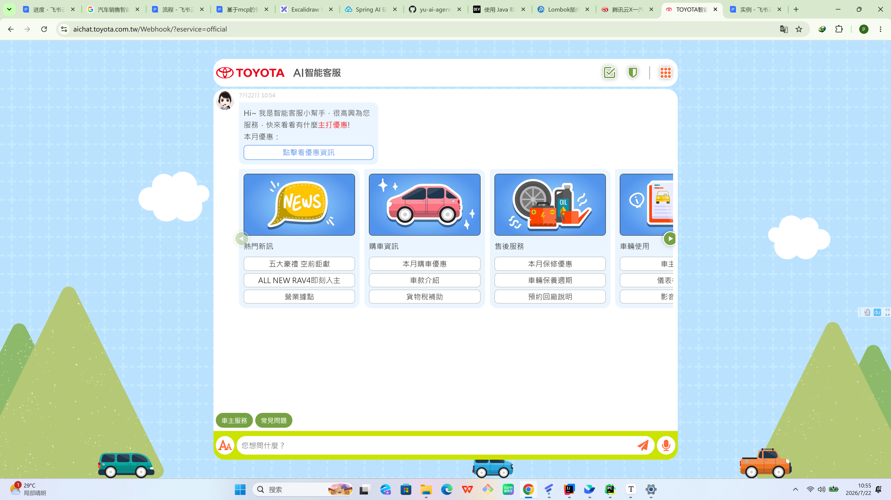

# 调研文档

# 一汽丰田\-车企智能客服

没有记忆而且全是预设回答，根据卡片选项一问就说抱歉我不知道你看看卡片上 有您需要的内容吗，前端挺卡通的，但是不需要做前端。

# 咸鱼智能客服\-\-\-电商

可以参考

1\.意图路由\+多agent策略

2\.动态调温\-\-在关键问题时注意力提高

|能力|来源|价值|
|---|---|---|
|**意图路由 \+ 多 Agent**|Xianyu|售前 / 售后 / 投诉分开，单一 Agent 扛不住所有场景|
|**手动接管机制**|Xianyu|销售随时可以切掉 AI 自己上|
||||
|**Prompt 注入防御** |Xianyu|no\_reply 分类 \+ 输出安全过滤|
|**动态温度策略**|Xianyu|砍价场景温度拉高让回复更灵活|
|**DI 容器 \+ 生命周期管理**|PDD|服务注册、线程安全、延迟加载|
|**上下文压缩摘要**|PDD|长对话时用 LLM 摘要历史，省 token|
|**消息过期丢弃**|Xianyu|超过 N 分钟的旧消息忽略，避免回错人|

# 拼多多智能客服（图形化界面）\-\-\-给电商

1. **工具驱动的 Agent 循环**

while loop \< max\_loops:

调 LLM → 返回 tool\_calls？→ 并行执行工具 → 结果回传 → 继续

返回 text？→ 最终回复

这是标准的 ReAct 模式实现，比 Xianyu 的纯 Prompt 方案强。

2. **知识库（KnowledgeService）（关键词匹配最差的实现）**

3. **MessageBuilder / Prompt 构建（硬编码\-\-总是亲，您好 等等）**

4. **多账号线程模型（可以考虑借鉴开多个客服账号）**

因为是电商所以死板的进行回复而不需要考虑所谓的幻觉和信誉问题，因为很大一部分人会跟客服胡搅蛮缠。

# 沃丰科技智能客服

上班期间应该还是人工回复的我还以为机器人呢。。。

流程比较完善，包括详细的用户画像刻画，潜在用户追踪。他们公司专门做智能客服的允许各个媒体账户账号，可以接入大部分社交软件，但是人家解决方案要钱不给我直接看。

