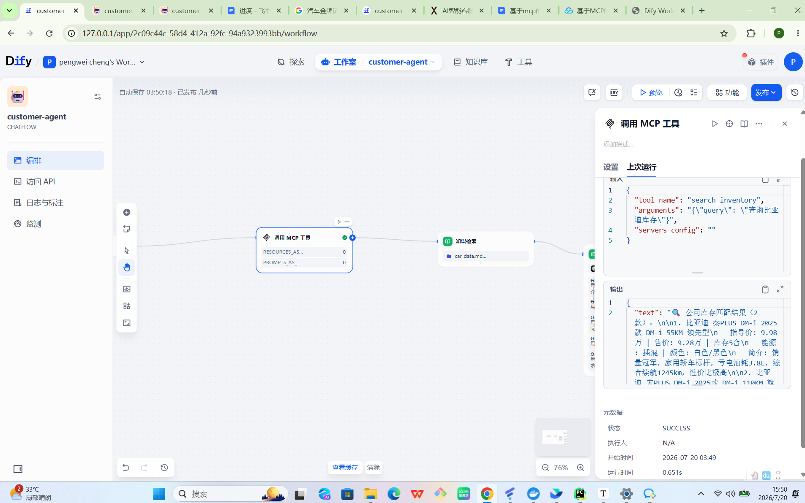

# 进度

# 7\.16:

搭建基础分支控制的workflow，三类：

1\.用户打招呼回复你好啊我有什么可以帮你的

2\.用户询问和限定范围内无关的问题回复抱歉我无法回复你的信息。用来阻止一些恶意输入。图片先不上传了，docker有问题，dify启动不了了，后面补上

3\.根据知识库召回，知识库后面链接llm，现在用的是之前我自己建的人类图知识库/软需知识库后续会替换成和车企有关的比如汽车型号汽车剩余量。

后续工作:

1\.加入之前的图片生成模块继续分支拓展，比如如果用户说给我什么什么照片要能给出生成的图片，至于生成的真实性不考虑，比如图片仅供参考，参考车辆的排版样式空间分配，类似于虚拟，给出讲解

2\.继续添加分支，要求能对模糊意图给出回复，比如你们这个车太贵了，等等

3\.0\-1拓展，接入微信，视频号等接口调用检测到收到信息能主动回复识别回复几条，然后收到联系方式能加联系方式。

# 7\.17

加入了图片生成的模块能对用户的输入要求和图片相关的就输出照片，但是只能输出猫的照片现在提示词有问题。

提示词没引用上下文，应用之后正常输出:

只能输出基础图片没法看到多角度的内饰图片等等、

# 对于模糊问题怎么进行处理？

github开源customer\-agent，模糊处理添加了关键词比如太烂了，考虑能否加在agent如果不方便就加在项目代码里面。开源项目是pdd的智能客服有ui。可以替换pdd账号为视频号接口。agent换成dify的智能体，提示词修改，最后边修改知识库的位置，目前使用sqlite存上传的知识库，可以考虑知识库放到agent里面由agent检索。

# 小demo：

dify后台api密钥：app\-jB66ujVtjpX82PrZ3SSuR4aG

dify工作流api服务器:本机http://127\.0\.0\.1/v1

fastapi简单网站测试能不能正常调difyagent以及工作情况：有一个小bug，讲解车辆给出的回复却是宝马车图片

# 分支归类定义回复内容（avoid）\-\-\-\-\-首先是要构建完善的知识库，让agent中llm检索知识库和根据提示词做出回复而不是通过分支控制。

# 关于回消息问题：做客服知识库效果应该会优于提示词来避免歧义出现。

比如多条信息回复理解，以及回复多条消息而不是回一条。

# 目前回复语气比较合理但是不支持多条消息

爬取了网易汽车的分类做了知识库用质谱的embedding能保证正确性

做了客服知识库一定程度上改善了模糊意义以及挑刺语句的回复和骗到线下买车的话术

bug:还是出现有上下文的情况下提示抱歉无法回复。（怎么解决同一段对话中的上下文问题？）

# workflow改成chatflow\-\-\-\-主要聊天为主，但是加微信等等操作还是需要work

# 7\.20

1\.做出来chatflow版本，之前的workflow不能存储对话记忆

改成chatflow

2\.重构客户话术知识库，从汽车之家知乎等等找金牌销售经验构成知识库一来作为引导买车的销售知识库二来做处理模糊语义情绪化语句的知识库

3\.更改chatflow格式后端更新api

4\.demo链接外部mcp。搭一个小的mcp server

5\.初步调研基于mcp的智能客服，撰写文档（不确定需不需要确定需求）

6\.建库\-示例数据库放了八条车辆库存

dify可以调用mcp工具查询数据库\-本地，给出汽车库存和报价。

7\.给mcp的search\_car函数添加bool返回值方便直接条件分支判断如果0 说明没库存了直接回复，1进入正常回复

最终实现通过if判断是否包含empty来决定分支。

## 待解决:

* [x] 构建知识库导入过一个连续追问搞清楚用户基本情况和需求的话术但是过于烦人总是问不停，需要重构知识库

* [x] 导入照片问题，sqlite里面放照片mcp调用取出来对应字段的照片作为file传出来

暂时先用stability生成照片

正常能显示照片了url直接显示的但是映射借助了数据库。

* [ ] 7\.21待办:

* [ ] 1\.继续调研智能客服，分析梳理需求

* [ ] 2\.优化分支结构逻辑和内容表述

* [ ] 3\.收集知识库构建内容继续补充知识库。

* [ ] 4\.AI幻觉\-\-\-自验证（迭代或者第三方ai验证）

* [ ] 5\.闲聊\-上限终止回复

* [ ] 6\.RPA控制企微发微信给微信

* [ ] 7\.构建知识库把汽车\-\-\-做相似查找，排序算法设计（购买热度，缩写啊等等langchain/JAVA）

* [ ] 8\.配置问题，公司地址仓店地址，联系方式

* [ ] 9\.识别多问题（确定核心意图还是\.\.\.\.\.\.\.）

* [ ] 10\.知识库映射（车名\-\-\-\-\-信息）

# 7\.21

幻觉:

1\.出现错误

2\.给出不想要的答案（答非所问或者所有偏差和真正的词义）

联网搜索 双ai验证 提示词工程

技术方案

1\.下载idea破解，学习写spring ai熟悉使用idea

2\.继续调研

针对配置问题可以直接写在提示词里面（但是根据顾客的ip做调整还要操作）

